# **Laporan Proyek Machine Learning - Prediksi Tingkat Obesitas Berdasarkan Pola Makan dan Kebiasaan Fisik Menggunakan Pembelajaran Mesin**

Nama: Wiefran Varenzo

email : lionwiefran88@gmail.com

## **Domain Proyek**

Obesitas merupakan salah satu permasalahan kesehatan global yang berdampak signifikan terhadap kualitas hidup manusia. Menurut data dari [World Health Organization (WHO)](https://www.who.int/news-room/facts-in-pictures/detail/6-facts-on-obesity), pada tahun 2016 lebih dari 1,9 miliar orang dewasa mengalami kelebihan berat badan, dan lebih dari 650 juta di antaranya tergolong obesitas. Prevalensi obesitas ini hampir tiga kali lipat sejak tahun 1975, menunjukkan tren peningkatan yang mengkhawatirkan secara global.

Peningkatan prevalensi obesitas menyebabkan beban ekonomi dan kesehatan yang tinggi karena meningkatkan risiko penyakit jantung, diabetes tipe 2, hipertensi, serta beberapa jenis kanker. Obesitas juga dikaitkan dengan peningkatan risiko kanker seperti kanker payudara, kolorektal, dan pankreas, sebagaimana dijelaskan dalam studi oleh Tiffany Scully dan rekan-rekannya pada penelitiannya di [Obesity, Type 2 Diabetes, and Cancer Risk (2021)](https://www.ncbi.nlm.nih.gov/pmc/articles/PMC7884814/). Di sisi ekonomi, beban yang ditimbulkan tidak hanya berupa biaya perawatan langsung, namun juga kehilangan produktivitas kerja, sebagaimana dipaparkan oleh Young-Rock Hong dan dan rekan-rekannya melalui penelitian [Excess Costs and Economic Burden of Obesity-Related Cancers in the United States](https://www.ncbi.nlm.nih.gov/pmc/articles/PMC7313233/).

Deteksi dini dan prediksi tingkat obesitas menjadi sangat penting dalam upaya pencegahan dan penanganan kondisi ini. Dengan memahami faktor-faktor yang berkontribusi terhadap obesitas, intervensi dapat dilakukan lebih awal untuk mencegah komplikasi serius. Teknologi berbasis data seperti pembelajaran mesin (machine learning) memiliki potensi besar dalam menganalisis pola kompleks dalam data kesehatan, sehingga mampu memberikan insight yang lebih presisi dibandingkan pendekatan konvensional.

Proyek ini bertujuan untuk mengembangkan model prediksi tingkat obesitas berdasarkan pola makan dan kebiasaan fisik individu. Model ini diharapkan dapat mengidentifikasi individu dengan risiko tinggi terhadap obesitas sehingga memungkinkan intervensi yang lebih efektif. Selain itu, pendekatan ini dapat menjadi dasar dalam merancang program kesehatan masyarakat serta kebijakan berbasis data yang lebih responsif terhadap masalah obesitas.

Sumber data yang digunakan dalam proyek ini adalah dataset [*Estimation of Obesity Levels Based on Eating Habits and Physical Condition*](https://archive.ics.uci.edu/dataset/544/estimation%2Bof%2Bobesity%2Blevels%2Bbased%2Bon%2Beating%2Bhabits%2Band%2Bphysical%2Bcondition) yang tersedia di UCI Machine Learning Repository. Dataset ini berisi data dari individu di Meksiko, Peru, dan Kolombia, dengan 17 atribut yang mencerminkan pola makan, aktivitas fisik, serta kebiasaan sehari-hari. Kelas target dalam dataset ini adalah tujuh kategori tingkat obesitas berdasarkan indeks massa tubuh (IMT), yang menjadi dasar utama dalam proses klasifikasi.

---

## **Business Understanding**

Obesitas merupakan salah satu permasalahan kesehatan masyarakat yang semakin meningkat secara global, dengan dampak signifikan terhadap kualitas hidup individu dan beban ekonomi sistem kesehatan. Oleh karena itu, diperlukan pendekatan berbasis data untuk memahami dan memprediksi kondisi ini, sehingga dapat dilakukan intervensi yang tepat dan lebih awal. Proyek ini bertujuan untuk menjawab pertanyaan-pertanyaan krusial terkait klasifikasi tingkat obesitas berdasarkan kebiasaan makan dan kondisi fisik menggunakan pendekatan machine learning.

### **Problem Statements**

1. **Bagaimana cara memprediksi tingkat obesitas seseorang berdasarkan kebiasaan makan dan kondisi fisik?**

   Permasalahan utama dalam proyek ini adalah membangun sistem prediksi obesitas dengan memanfaatkan data seperti frekuensi konsumsi makanan berkalori tinggi, aktivitas fisik mingguan, kebiasaan merokok, konsumsi air, dan lainnya. Mengingat data ini bersifat multivariat dan heterogen (numerik dan kategorikal), maka diperlukan pendekatan prediktif yang mampu menangani kompleksitas tersebut.
2. **Fitur-fitur mana yang paling berkontribusi dalam memprediksi tingkat obesitas?**

   Dalam upaya membangun model yang efisien dan akurat, penting untuk mengidentifikasi atribut mana yang memiliki pengaruh terbesar terhadap hasil klasifikasi. Ini tidak hanya meningkatkan kinerja model tetapi juga memberi insight yang berguna untuk pembuatan kebijakan atau rekomendasi gaya hidup yang lebih terarah.
3. **Algoritma mana yang memberikan hasil prediksi terbaik untuk masalah ini?**

   Dalam proyek ini akan dibandingkan beberapa algoritma machine learning, seperti, Random Forest dan SVM, untuk mengetahui mana yang paling efektif dalam memprediksi tingkat obesitas berdasarkan data yang tersedia. Evaluasi akan dilakukan menggunakan metrik seperti akurasi, precision, recall, dan F1-score.

### **Goals**

1. **Membangun model klasifikasi yang dapat mengkategorikan tingkat obesitas seseorang secara akurat.**

   Model ini diharapkan mampu mengklasifikasikan individu ke dalam tujuh kelas tingkat obesitas yang berbeda (dari underweight hingga obesity type III) berdasarkan kombinasi kebiasaan makan dan faktor fisik. Model ini nantinya dapat diintegrasikan ke dalam aplikasi atau sistem monitoring kesehatan.
2. **Melakukan feature selection untuk mengetahui atribut penting dalam klasifikasi obesitas.**

   Dengan menggunakan metode seperti Recursive Feature Elimination (RFE), proyek ini bertujuan menyederhanakan model dan mengurangi overfitting dengan hanya mempertahankan fitur yang memiliki kontribusi paling signifikan terhadap klasifikasi obesitas.
3. **Membandingkan dua algoritma machine learning dan memilih model terbaik berdasarkan evaluasi metrik**

   Setelah membangun dan melatih model, performa masing-masing algoritma akan dibandingkan untuk menentukan mana yang paling sesuai dengan data dan tujuan klasifikasi obesitas. Kriteria evaluasi akan mencakup metrik performa dan efisiensi model.

### **Solution Statement**

Untuk mencapai tujuan dalam membangun model klasifikasi obesitas yang akurat dan efisien, proyek ini menerapkan beberapa solusi teknis yang sistematis. Setiap solusi dirancang agar dapat dievaluasi secara kuantitatif menggunakan metrik evaluasi seperti *accuracy*, *precision*, *recall*, dan *F1-score*.

#### **Solusi 1: Penggunaan Dua Algoritma Machine Learning Berbeda (Baseline Model)**

Langkah pertama dalam pendekatan ini adalah membangun dua model klasifikasi baseline menggunakan algoritma:

* **Support Vector Machine (SVM)** tanpa hyperparameter tuning,
* **Random Forest Classifier** tanpa hyperparameter tuning.

Kedua model dilatih menggunakan data yang telah diseimbangkan dengan SMOTE dan diukur performanya berdasarkan metrik *accuracy*. Model SVM dan Random Forest ini disimpan sebagai baseline awal sebelum dilakukan optimasi lebih lanjut.

#### **Solusi 2: Hyperparameter Tuning untuk Meningkatkan Performa Model**

Setelah baseline terbentuk, dilakukan proses **Grid Search dengan cross-validation (CV=5)** untuk menemukan kombinasi parameter terbaik bagi kedua model:

* Untuk **SVM**, parameter yang diuji meliputi `C`, `kernel`, dan `gamma`.
* Untuk **Random Forest**, parameter meliputi `n_estimators`, `max_depth`, `min_samples_split`, `min_samples_leaf`, dan `max_features`.

Model hasil tuning ini dievaluasi menggunakan data uji yang sama dan dibandingkan performanya dengan model baseline. Evaluasi fokus pada peningkatan nilai *accuracy*, dan model terbaik dari tahap ini disimpan untuk digunakan dalam tahap selanjutnya.

#### **Solusi 3: Feature Selection untuk Optimasi Model**

Setelah model dengan hyperparameter optimal diperoleh, dilakukan proses feature selection untuk menyederhanakan model dan meningkatkan efisiensi prediksi. Fitur-fitur terpilih digunakan untuk membentuk subset baru dari data pelatihan dan pengujian. SMOTE diterapkan ulang pada subset data ini agar tetap seimbang.

Model SVM dan Random Forest kemudian **dilatih ulang dengan parameter terbaik masing-masing** menggunakan data dengan fitur yang telah diseleksi. Proses ini diharapkan menghasilkan model dengan performa prediksi yang lebih baik, sekaligus mempermudah interpretasi karena jumlah fitur yang lebih sedikit.

Dengan tiga solusi ini, pendekatan yang digunakan tidak hanya fokus pada peningkatan **akurasi prediksi**, tetapi juga menyeimbangkan antara **efisiensi komputasi**, **kemampuan generalisasi model**, dan **interpretabilitas hasil**. Semua proses ini dilakukan secara terukur menggunakan metrik evaluasi yang telah distandarisasi dan hasil akhirnya disimpan dalam format file `.pkl`, memungkinkan model digunakan kembali pada proses deployment atau pengujian lebih lanjut tanpa perlu pelatihan ulang.

Adapun **metrik evaluasi** yang digunakan meliputi:

* **Accuracy**: mengukur proporsi prediksi yang benar dari seluruh prediksi,
* **Precision (Macro)** dan **Precision (Weighted)**: menunjukkan seberapa tepat prediksi model per kelas, dengan *macro* menghitung rata-rata tanpa memperhatikan proporsi data dan *weighted* menghitung dengan mempertimbangkan proporsi tiap kelas,
* **Recall (Macro)** dan **Recall (Weighted)**: mengukur seberapa baik model menangkap semua instance dari tiap kelas (true positive rate), baik secara rata-rata per kelas (macro) maupun tertimbang berdasarkan distribusi kelas (weighted),
* **F1 Score (Macro)** dan **F1 Score (Weighted)**: merupakan harmoni antara precision dan recall, baik rata-rata antar kelas maupun tertimbang,
* **Cohen’s Kappa**: mengukur kesepakatan antara prediksi model dan label sebenarnya dengan memperhitungkan kemungkinan kesepakatan yang terjadi secara acak,
* **Matthews Correlation Coefficient (MCC)**: memberikan gambaran menyeluruh tentang kualitas klasifikasi, bahkan saat terjadi ketidakseimbangan data antar kelas.

Metrik-metrik ini memberikan gambaran yang komprehensif terhadap kinerja model, tidak hanya dari sisi ketepatan klasifikasi tetapi juga dari sisi keandalan dan stabilitas prediksi dalam skenario nyata yang kompleks.

## **Data Understanding**

Dataset yang digunakan dalam proyek ini adalah hasil dari penelitian berjudul "Estimation of Obesity Levels through the Proposed Predictive Approach Based on Physical Activity and Nutritional Habits" yang ditulis oleh Harika Gozde Gozukara dan kolega, dapat diakses melalui Semantic Scholar. Dataset ini tersedia publik melalui UCI Machine Learning Repository.

Dataset ini berisi informasi tentang kebiasaan makan, gaya hidup, dan kondisi fisik individu dari Meksiko, Kolombia, dan Peru, dengan tujuan untuk mengklasifikasikan tingkat obesitas seseorang berdasarkan variabel-variabel tersebut. Total terdapat 2111 baris data (responden) dengan 17 fitur input dan 1 target label bernama NObeyesdad.

**Berikut adalah link tautan dataset:** https://archive.ics.uci.edu/dataset/544/estimation+of+obesity+levels+based+on+eating+habits+and+physical+condition

**Berikut adalah rincian setiap kolomnya:**

* **Numerikal (Kontinu & Integer)**:

  * `Age`-> Umur (Dalam tahun), Tipe Data: float64
  * `Height`-> Tinggi (Dalam meter), Tipe Data: float64
  * `Weight`-> Berat (Dalam kilogram), Tipe Data: float64
  * `FCVC`-> Frekuensi makan sayur, Tipe Data: float64
  * `NCP` -> Jumlah makan utama per hari, Tipe Data: float64
  * `CH2O`-> Jumlah konsumsi air per hari(Dalam liter), Tipe Data: float64
  * `FAF`-> Frekuensi aktivitas fisik, Tipe Data: float64
  * `TUE`-> Waktu penggunaan perangkat teknologi, Tipe Data: float64
* **Kategorikal / Biner**:

  * `Gender`-> Jenis kelamin (Male, Female), Tipe Data: object
  * `family_history_with_overweight`-> Riwayat keluarga dengan obesitas (Yes, No), Tipe Data: object
  * `FAVC`-> Konsumsi makanan tinggi kalori (Yes, No), Tipe Data: object
  * `CAEC`-> Makan di antara jam makan utama (Sometimes, Frequently, Always, No), Tipe Data: object
  * `SMOKE`-> Merokok atau tidak (Yes, No), Tipe Data: object
  * `SCC`-> Pemantauan kalori harian (Yes, No), Tipe Data: object
  * `CALC` Frekuensi konsumsi alkohol (Sometimes, Frequently, Always, No), Tipe Data: object
  * `MTRANS`-> Jenis transportasi yang digunakan (Public_Transportation, Automobile, Walking, Motorbike, Bike), Tipe Data: object

Target label `NObeyesdad` merupakan kategori obesitas:

* Normal_Weight
* Insufficient_Weight,
* Overweight_Level_I,
* Overweight_Level_II,
* Obesity_Type_I,
* Obesity_Type_II,
* Obesity_Type_III	.

### **Exploratory Data Analysis (EDA)**

Untuk memahami struktur dan distribusi data, beberapa tahapan EDA dilakukan sebagai berikut:

1. **Struktur Data dan Statistik Deskriptif**

   * Melalui `df.info()` dan `df.describe()` untuk melihat tipe data dan ringkasan statistik fitur numerik.

   * Hasil: Tidak ditemukan nilai NaN dalam dataset.

   >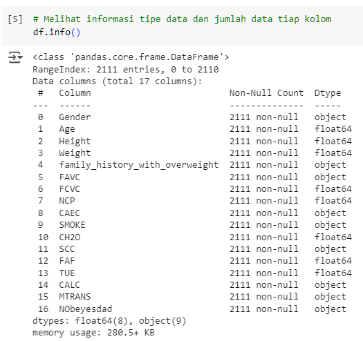
   
   >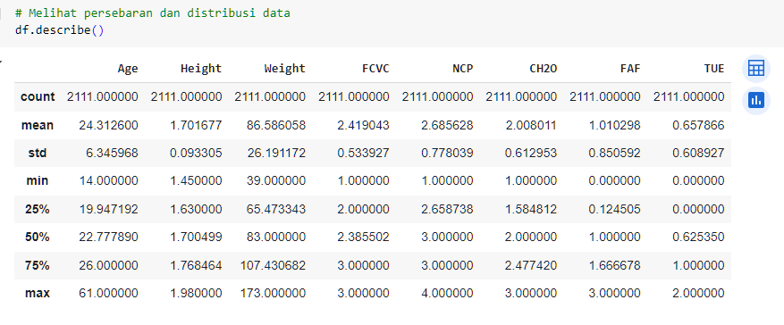


2. **Distribusi Fitur Numerik**

   * Digunakan histogram dan boxplot untuk memahami penyebaran nilai pada kolom `Weight`, `Height`, `Age`, `FAF`, dan lainnya.

   * Teridentifikasi adanya outlier pada beberapa fitur seperti `Weight` dan `TUE`.

   > 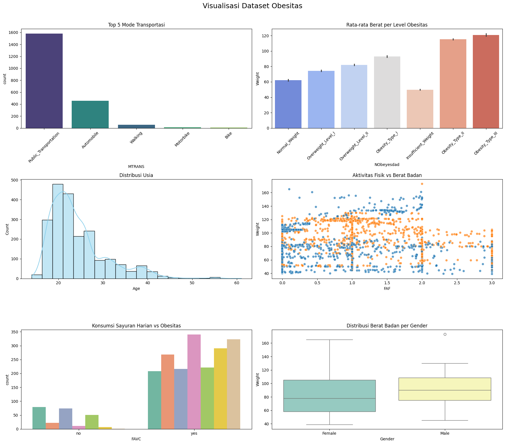

3. **Korelasi antar Fitur Numerik**

   * Korelasi dihitung menggunakan `.corr()` dan divisualisasikan melalui heatmap.

   * Menunjukkan bahwa `Weight` berkorelasi positif dengan `Height` dan `FAF`.

   > 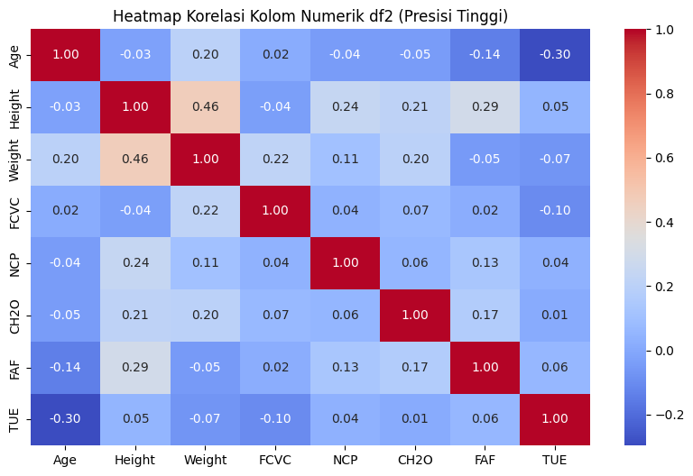

4. **Distribusi Kelas Target**

   * Distribusi nilai pada kolom `NObeyesdad` divisualisasikan dengan bar chart.

   * Terlihat ketidakseimbangan kelas: kelas *Normal Weight* dan *Obesity Type I* mendominasi dataset.

   > 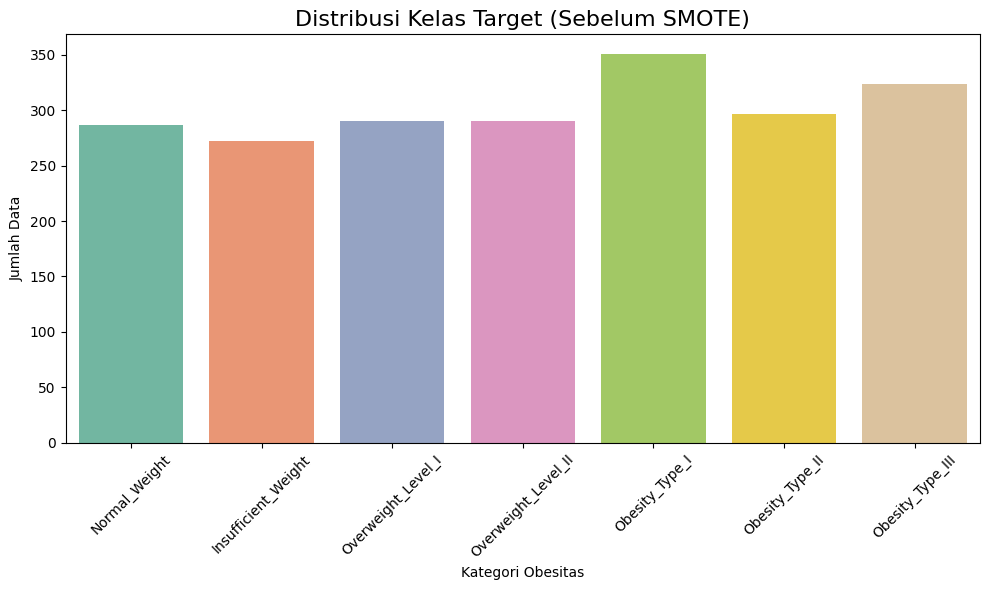

5. **Mengetahui Data Numerik atau Kategorial**

   * Penentuan Data numerik dan kategorial sangat di butuhkan untuk mengetahui data mana yang akan di lanjutkan ke preprocessing seperti kategorial akan di encode, lalu data numerik akan di normalisasi dengan scaler atau normalisasi lainnya.
   
      ```python
      # Melihat kolom berdasarkan tipe data Numerik atau Kategori
      num_cols_df = df.select_dtypes(include=['int64', 'float64']).columns
      cat_cols_df = df.select_dtypes(include=['object', 'category']).columns
      print(f'Kolom Numerik: {num_cols_df}')
      print(f'Kolom Kategori: {cat_cols_df}')
      ```
      Sehingga menghasilkan pembagian kolom sebagai berikut:
      * Kolom Numerik: Age, Height, Weight, FCVC, NCP, CH2O, FAF, TUE
      * Kolom Kategori: Gender, family_history_with_overweight, FAVC, CAEC, SMOKE, SCC, CALC, MTRANS, NObeyesdad


6. **Distribusi Fitur Kategorikal**

   * Frekuensi untuk fitur kategorikal (seperti `Gender`, `SMOKE`, `FAVC`) dianalisis menggunakan `value_counts()` dan divisualisasikan dengan diagram batang.

   > 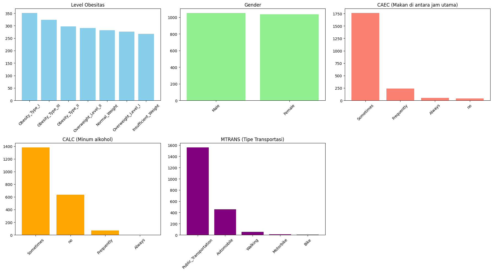
7. **Melihat data null atau tidak**

   * Menggunakan kode `df.isna().sum()` Untuk melihat adanya data null atau tidak, serta kokde `df.duplicated().sum()`, dimana setelah di jalankan, tidak ada data yang null, namun dataset memiliki data duplikat sebanyak 24 buah

      ```
      np.int64(24)
      ```

---

### **Kesimpulan EDA**

Dari hasil eksplorasi data:

* Dataset cukup bersih tanpa nilai kosong, tetapi memiliki 24 data duplikat
* Terdapat outlier pada beberapa fitur numerik yang tidak perlu dipertimbangkan dalam preprocessing karena masih dalam nilai yang wajar, serta ini adalah fakta lapangan (contoh weight 173 kg yang di dunia nyata benar benar ada orang dengan berat seperti itu).
* Data target bersifat multi-kelas dan tidak seimbang, sehingga membutuhkan penanganan seperti SMOTE.
* Banyak fitur kategorikal sehingga memerlukan encoding sebelum modeling.

## **Data Preparation**

1. Menghapus Data Null

   ```python
   df = df.dropna()
   ```

   **Alasan:**
   Data null dapat menyebabkan error dalam pemrosesan dan pelatihan model. Dengan menghapus baris yang memiliki nilai kosong, kita memastikan bahwa model menerima data yang bersih dan lengkap.
2. Menghapus Data Duplikat

   ```python
   df = df.drop_duplicates()
   ```

   **Alasan:**
   Data duplikat dapat mengganggu distribusi statistik dan menyebabkan overfitting pada model. Menghapusnya membantu menjaga kualitas dan representasi data yang sebenarnya.
3. Deteksi Outlier Menggunakan Metode IQR

   ```python
   # Mendeteksi outlier dengan metode IQR
   def detect_outliers_iqr(data, column):
       Q1 = data[column].quantile(0.25)
       Q3 = data[column].quantile(0.75)
       IQR = Q3 - Q1
       lower_bound = Q1 - 1.5 * IQR
       upper_bound = Q3 + 1.5 * IQR
       outliers = data[(data[column] < lower_bound) | (data[column] > upper_bound)]
       return outliers, lower_bound, upper_bound
   
   ...

   ```

   **Alasan:**
   Outlier dapat menyebabkan skala data menjadi bias dan mempengaruhi performa model, terutama pada algoritma yang sensitif terhadap distribusi nilai seperti regresi dan SVM. IQR digunakan karena merupakan metode yang robust terhadap distribusi non-normal. Tetapi pada proses klasifikasi kali ini, outlier masih pada tahapan normal dan merupakan data valid sebagai data faktual yang ada di dunia nyata, sehingga data-data outlier ini akan digunakan)

---

4. Visualisasi Outlier dengan Boxplot

   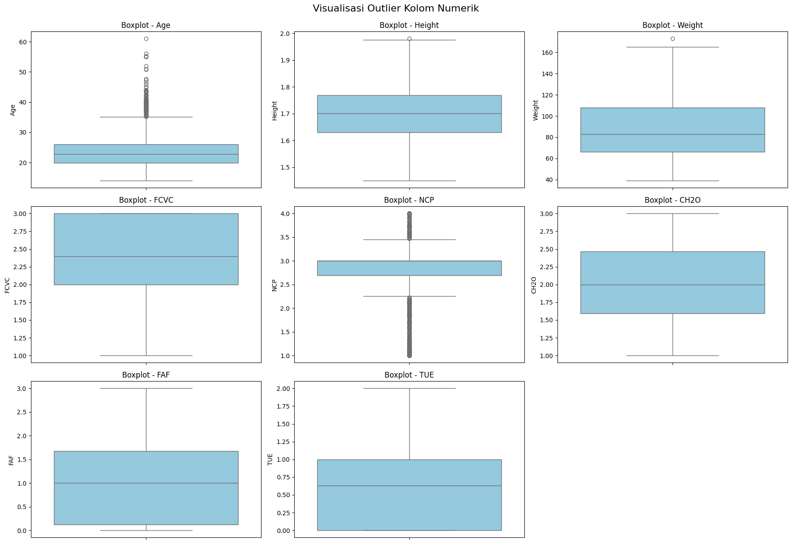

   **Alasan:**
   Visualisasi boxplot membantu dalam mendeteksi outlier secara intuitif dan memperkuat hasil deteksi outlier dari metode IQR.

---

5. Mapping Manual Label Target

   ```python
   order = [
   'Insufficient_Weight',
   'Normal_Weight',
   'Overweight_Level_I',
   'Overweight_Level_II',
   'Obesity_Type_I',
   'Obesity_Type_II',
   'Obesity_Type_III'
   ]
   ```

   **Alasan:**
   Agar memiliki konsistensi dalam hal klasifikasi data ordinal, maka maping manual label target harus dilakukan berdasarkan level obesitas dari yang terendah hingga level obesitas tertinggi. Hal ini perlu dilakukan sebelum melakukan encoding untuk kolom target NObeyesdad. Hal ini bisa berdampak pada konsistensi hasil model nantinya.

---

6. Encoding Fitur Kategorikal (Selain Target)

      ```python
      # Mapping target ke angka
      target_map = {label: idx for idx, label in enumerate(order)}
      data['NObeyesdad'] = data['NObeyesdad'].map(target_map)
      # Label Encoding fitur kategorikal selain target
      label_encoders = {}
      for col in data.select_dtypes(include='object').columns:
         if col != 'NObeyesdad':
            le = LabelEncoder()
            data[col] = le.fit_transform(data[col])
            label_encoders[col] = le
      ```

      **Alasan:**

      Fitur kategorikal dalam bentuk string perlu diubah menjadi angka agar dapat diproses oleh algoritma machine learning. Dengan `LabelEncoder`, setiap kategori diberi nilai integer unik. Pendekatan ini cocok untuk fitur kategorikal non-target dalam dataset. Menyimpan `LabelEncoder` penting agar proses encoding saat prediksi konsisten dengan saat training. Lalu, untuk label target sendiri, itu secara manual mengikuti order yang sudah ditetapkan (langkah ke-5)

---

7. Normalisasi Fitur Numerikal

      ```python
      # Normalisasi untuk kolom numerik (selain target)
      scaler = StandardScaler()
      numerical_cols = data.select_dtypes(include=['int64', 'float64']).columns.drop('NObeyesdad')
      data[numerical_cols] = scaler.fit_transform(data[numerical_cols])
      ```

      **Alasan:**

      Normalisasi bertujuan menyamakan skala fitur numerik agar memiliki distribusi dengan mean 0 dan standar deviasi 1. Hal ini membantu meningkatkan performa model, terutama algoritma yang sensitif terhadap skala fitur seperti KNN, SVM, atau saat menggunakan model ensemble seperti Random Forest agar setiap fitur memiliki kontribusi yang proporsional.

---
8. Pemisahan Data dan Penanganan Imbalanced Class

   Sebelum melakukan training model, data dibagi menjadi dua bagian: data latih (train) dan data uji (test). Setelah itu, dilakukan penanganan terhadap kelas yang tidak seimbang (imbalanced) menggunakan **SMOTE (Synthetic Minority Oversampling Technique)**.

   ```python
   from imblearn.over_sampling import SMOTE
   smote = SMOTE(random_state=42)
   X_train_sm, y_train_sm = smote.fit_resample(X_train, y_train)
   ```

   > **Penjelasan:** SMOTE menghasilkan data sintetis untuk kelas minoritas sehingga distribusi kelas menjadi seimbang, yang penting untuk menghindari bias model terhadap kelas mayoritas.
   >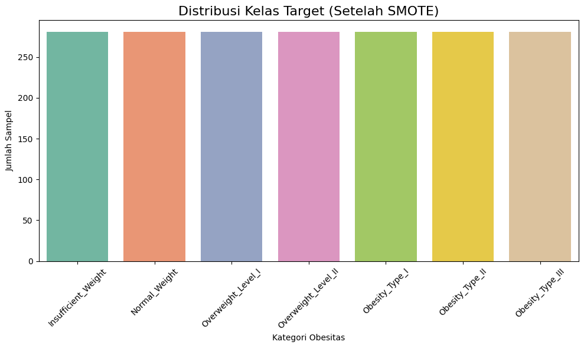


---

## **Modeling**

Pada tahap ini, saya membangun model klasifikasi untuk memprediksi target variabel pada dataset. Algoritma yang digunakan adalah **Support Vector Machine (SVM)** dan **Random Forest Classifier**. Proses modeling dilakukan secara bertahap dengan tiga perlakuan berbeda agar dapat melihat pengaruh hyperparameter tuning dan feature selection terhadap performa model. Berikut adalah tahapan lengkapnya:

---

1. **Modeling Sebelum Hyperparameter Tuning & Sebelum Feature Selection**

   Pada tahap awal ini, model dilatih tanpa melakukan tuning dan tanpa menghapus fitur. Ini berfungsi sebagai baseline untuk membandingkan hasil setelah dilakukan optimasi.

   ```python
   # SVM
   svm = SVC()
   svm.fit(X_train_sm, y_train_sm)
   y_pred_svm = svm.predict(X_test)

   # Random Forest
   rf = RandomForestClassifier(random_state=42)
   rf.fit(X_train_sm, y_train_sm)
   y_pred_rf = rf.predict(X_test)
   ```

   **Hasil Akurasi:**

   * Akurasi SVM (tanpa tuning & FS): `0.861244019138756` atau 86% akurasi.
   * Akurasi Random Forest (tanpa tuning & FS): `0.9545454545454546` atau 95,45% akurasi.

   ---
2. **Modeling Setelah Hyperparameter Tuning & Sebelum Feature Selection**

   Pada tahap ini, dilakukan **tuning hyperparameter** menggunakan **GridSearchCV** untuk mencari kombinasi parameter terbaik bagi masing-masing model. Namun, fitur yang digunakan masih sama seperti sebelumnya (belum dilakukan feature selection).

   ```python
   # GridSearchCV untuk SVM
   svm_params = {'C': [0.1, 1, 10], 'kernel': ['linear', 'rbf'], 'gamma': ['scale', 'auto']}
   svm_grid = GridSearchCV(SVC(), svm_params, cv=5, scoring='accuracy', n_jobs=-1)
   svm_grid.fit(X_train_sm, y_train_sm)
   best_svm = svm_grid.best_estimator_

   # GridSearchCV untuk Random Forest
   rf_params = {
       'n_estimators': [100, 200, 300],
       'max_depth': [None, 10, 20],
       'min_samples_split': [2, 5],
       'min_samples_leaf': [1, 2],
       'max_features': ['sqrt', 'log2']
   }
   rf_grid = GridSearchCV(RandomForestClassifier(random_state=42), rf_params, cv=5, scoring='accuracy', n_jobs=-1)
   rf_grid.fit(X_train_sm, y_train_sm)
   best_rf = rf_grid.best_estimator_
   ```

   **Hasil Akurasi:**

   * Akurasi SVM (setelah tuning, sebelum FS): `{'C': 10, 'gamma': 'scale', 'kernel': 'linear'}`
   * Parameter terbaik SVM: `0.9617224880382775`
   * Akurasi Random Forest (setelah tuning, sebelum FS): `0.9521531100478469`
   * Parameter terbaik RF: `{'max_depth': None, 'max_features': 'sqrt', 'min_samples_leaf': 1, 'min_samples_split': 2, 'n_estimators': 300}`


---

4. **Feature Selection Menggunakan RFE**

   Sebelum model dituning ulang, dilakukan **feature selection** menggunakan **Recursive Feature Elimination (RFE)** dengan Random Forest sebagai estimator untuk memilih 10 fitur paling penting.

   ```python
   model = RandomForestClassifier(random_state=42)
   rfe = RFE(estimator=model, n_features_to_select=10)
   rfe.fit(X, y)
   selected_features = X.columns[rfe.support_]
   ```

   > **Penjelasan:** Dengan mengurangi jumlah fitur ke yang paling relevan, kita menghindari overfitting dan mempercepat proses training.
   >

---

5. **Modeling Setelah Hyperparameter Tuning & Setelah Feature Selection**

   Setelah fitur penting dipilih, SMOTE diterapkan kembali pada subset fitur terpilih, dan model ditraining ulang menggunakan parameter terbaik hasil tuning sebelumnya.

   ```python
   X_train_selected = X_train[selected_features]
   X_test_selected = X_test[selected_features]

   X_train_selected_sm, y_train_sm = smote.fit_resample(X_train_selected, y_train)

   # SVM
   svm_grid.fit(X_train_selected_sm, y_train_sm)
   best_svm_selected = svm_grid.best_estimator_
   y_pred_svm_selected = best_svm_selected.predict(X_test_selected)

   # Random Forest
   rf_grid.fit(X_train_selected_sm, y_train_sm)
   best_rf_selected = rf_grid.best_estimator_
   y_pred_rf_selected = best_rf_selected.predict(X_test_selected)
   ```

   **Hasil Akurasi:**

   * Akurasi SVM (setelah tuning & FS): `0.9641148325358851`
   * Akurasi SVM (setelah tuning, sebelum FS): `{'C': 10, 'gamma': 'scale', 'kernel': 'linear'}
   * Akurasi Random Forest (setelah tuning & FS): `0.9401913875598086`
   * Parameter terbaik RF: `{'max_depth': None, 'max_features': 'sqrt', 'min_samples_leaf': 1, 'min_samples_split': 2, 'n_estimators': 300}`
   

   > Model ini merupakan versi paling optimal karena menggunakan parameter terbaik dan hanya fitur yang paling relevan. Diharapkan performa meningkat dan model menjadi lebih generalis.
   >

## **Evaluasi**

**Tujuan Evaluasi**

Evaluasi model dilakukan untuk mengetahui seberapa baik model klasifikasi dalam memprediksi label target. Dalam proyek ini, karena data merupakan **klasifikasi multikelas dengan potensi imbalance**, maka metrik evaluasi yang digunakan tidak hanya akurasi, namun juga mencakup metrik lain yang mempertimbangkan distribusi antar kelas.

---

**Metrik Evaluasi yang Digunakan**

Berikut adalah daftar metrik yang digunakan beserta penjelasan dan alasan penggunaannya:

1. **Accuracy**

   $$
   \text{Accuracy} = \frac{TP + TN}{TP + TN + FP + FN}
   $$

   * Mengukur proporsi prediksi yang benar terhadap seluruh prediksi.
   * Cocok untuk data seimbang, tetapi **kurang informatif jika data tidak seimbang**.
2. **Precision (Macro & Weighted)**

   $$
   \text{Precision} = \frac{TP}{TP + FP}
   $$

   * **Macro**: rata-rata precision tiap kelas tanpa mempertimbangkan jumlah data per kelas.
   * **Weighted**: memperhitungkan distribusi kelas (lebih akurat untuk data tidak seimbang).
   * Berguna untuk mengukur **seberapa relevan prediksi positif** dari model.
3. **Recall (Macro & Weighted)**

   $$
   \text{Recall} = \frac{TP}{TP + FN}
   $$

   * Menunjukkan **kemampuan model menangkap semua instance dari kelas tertentu**.
   * Recall penting saat **False Negative** harus diminimalkan.
4. **F1 Score (Macro & Weighted)**

   $$
   \text{F1} = 2 \times \frac{\text{Precision} \times \text{Recall}}{\text{Precision} + \text{Recall}}
   $$

   * Harmonic mean antara Precision dan Recall.
   * **Macro** dan **Weighted** digunakan untuk memahami performa global, terutama saat dataset tidak seimbang.
5. **Cohen’s Kappa**

   $$
   \kappa = \frac{p_o - p_e}{1 - p_e}
   $$

   * Mengukur tingkat kesepakatan antara prediksi dan label aktual **dengan mengoreksi kemungkinan prediksi acak**.
   * Cocok untuk klasifikasi multikelas.
6. **Matthews Correlation Coefficient (MCC)**

   $$
   \text{MCC} = \frac{(TP \times TN) - (FP \times FN)}{\sqrt{(TP + FP)(TP + FN)(TN + FP)(TN + FN)}}
   $$

   * Salah satu metrik paling **andalan dalam klasifikasi tidak seimbang**.
   * Memberikan nilai antara -1 dan +1.
7. **Classification Report**

   * Memberikan detail lengkap untuk precision, recall, dan f1-score untuk masing-masing kelas.
8. **Confusion Matrix**

   * Matriks yang menunjukkan distribusi prediksi benar dan salah antar kelas.
   * Visualisasi ini membantu mengidentifikasi di kelas mana model masih sering keliru.

---
#### **Hasil Evaluasi Setiap Model**
1. **Sebelum Hyperparametertuning dan Sebelum Feature Selection**
   
    **SVM**
      ```
    Accuracy: 0.8612
    Precision (Macro): 0.8589
    Precision (Weighted): 0.8630
    Recall (Macro): 0.8574
    Recall (Weighted): 0.8612
    F1 Score (Macro): 0.8573
    F1 Score (Weighted): 0.8613
    Cohen’s Kappa: 0.8379
    Matthews Corrcoef: 0.8382


                 precision    recall   f1-score  support

           0       0.91      0.94      0.93        53
           1       0.70      0.77      0.73        57
           2       0.76      0.75      0.75        55
           3       0.82      0.72      0.77        58
           4       0.89      0.91      0.90        70
           5       0.93      0.93      0.93        60
           6       1.00      0.97      0.98        65

    accuracy                           0.86     418
    macro avg       0.86      0.86     0.86     418
    weighted avg    0.86      0.86     0.86     418
      ```
      **Confusion Matrix:**
      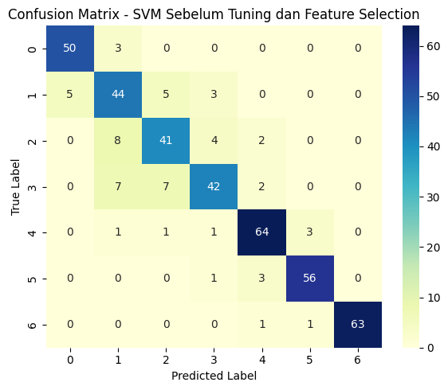


    **Random Forest**
      ```
    Accuracy: 0.9545
    Precision (Macro): 0.9553
    Precision (Weighted): 0.9565
    Recall (Macro): 0.9524
    Recall (Weighted): 0.9545
    F1 Score (Macro): 0.9532
    F1 Score (Weighted): 0.9548
    Cohen’s Kappa: 0.9469
    Matthews Corrcoef: 0.9471


                 precision    recall  f1-score   support

           0       1.00      0.96      0.98        53
           1       0.86      0.95      0.90        57
           2       0.91      0.91      0.91        55
           3       0.98      0.90      0.94        58
           4       0.97      1.00      0.99        70
           5       0.98      0.97      0.97        60
           6       0.98      0.98      0.98        65

    accuracy                           0.95     418
    macro avg       0.96      0.95     0.95     418
    weighted avg    0.96      0.95     0.95     418
      ```
      **Confusion Matrix:**
      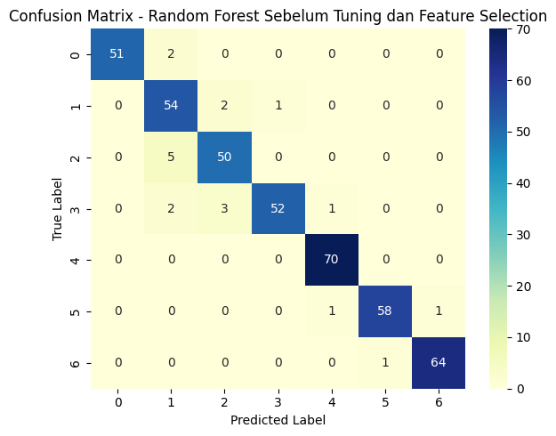

2. **Sesudah Hyperparametertuning dan Sebelum Feature Selection**
   
    **SVM**
      ```
    Accuracy: 0.9617
    Precision (Macro): 0.9620
    Precision (Weighted): 0.9623
    Recall (Macro): 0.9609
    Recall (Weighted): 0.9617
    F1 Score (Macro): 0.9611
    F1 Score (Weighted): 0.9617
    Cohen’s Kappa: 0.9553
    Matthews Corrcoef: 0.9554


                 precision    recall  f1-score   support

           0       0.95      1.00      0.97        53
           1       0.98      0.95      0.96        57
           2       0.96      0.91      0.93        55
           3       0.93      0.95      0.94        58
           4       0.95      0.99      0.97        70
           5       0.97      0.97      0.97        60
           6       1.00      0.97      0.98        65

    accuracy                         0.96        418
    macro avg       0.96   0.96      0.96        418
    weighted avg    0.96   0.96      0.96        418
      ```
      **Confusion Matrix:**
      


    **Random Forest**
      ```
    Accuracy: 0.9522
    Precision (Macro): 0.9527
    Precision (Weighted): 0.9540
    Recall (Macro): 0.9499
    Recall (Weighted): 0.9522
    F1 Score (Macro): 0.9507
    F1 Score (Weighted): 0.9525
    Cohen’s Kappa: 0.9441
    Matthews Corrcoef: 0.9443


                 precision    recall  f1-score   support

           0       1.00      0.96      0.98        53
           1       0.85      0.93      0.89        57
           2       0.89      0.91      0.90        55
           3       0.98      0.90      0.94        58
           4       0.97      1.00      0.99        70
           5       0.98      0.97      0.97        60
           6       0.98      0.98      0.98        65

    accuracy                          0.95      418
    macro avg      0.95      0.95     0.95      418
    weighted avg   0.95      0.95     0.95      418
      ```
      **Confusion Matrix:**
      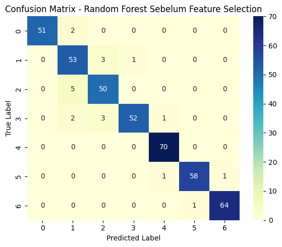

3. **Sesudah Hyperparametertuning dan Sesudah Feature Selection**
   
    **SVM**
      ```
    Accuracy: 0.9641
    Precision (Macro): 0.9632
    Precision (Weighted): 0.9643
    Recall (Macro): 0.9624
    Recall (Weighted): 0.9641
    F1 Score (Macro): 0.9625
    F1 Score (Weighted): 0.9639
    Cohen’s Kappa: 0.9581
    Matthews Corrcoef: 0.9582


        precision    recall  f1-score   support

           0       0.96      1.00      0.98        53
           1       0.98      0.96      0.97        57
           2       0.94      0.87      0.91        55
           3       0.90      0.93      0.92        58
           4       0.97      1.00      0.99        70
           5       0.98      0.98      0.98        60
           6       1.00      0.98      0.99        65

    accuracy                           0.96      418
    macro avg      0.96      0.96      0.96      418
    weighted avg   0.96      0.96      0.96      418
      ```
      **Confusion Matrix:**
      


    **Random Forest**
      ```
    Accuracy: 0.9402
    Precision (Macro): 0.9415
    Precision (Weighted): 0.9419
    Recall (Macro): 0.9372
    Recall (Weighted): 0.9402
    F1 Score (Macro): 0.9382
    F1 Score (Weighted): 0.9398
    Cohen’s Kappa: 0.9301
    Matthews Corrcoef: 0.9305

    precision    recall  f1-score   support

           0       1.00      0.96      0.98        53
           1       0.87      0.96      0.92        57
           2       0.87      0.85      0.86        55
           3       0.94      0.83      0.88        58
           4       0.92      1.00      0.96        70
           5       1.00      0.97      0.98        60
           6       0.98      0.98      0.98        65

    accuracy                         0.94      418
    macro avg       0.94     0.94    0.94      418
    weighted avg    0.94     0.94    0.94      418
      ```
      **Confusion Matrix:**
      

---
### **Analisis Performa Model**

Model **Support Vector Machine (SVM)** menunjukkan peningkatan performa yang signifikan seiring dengan diterapkannya proses hyperparameter tuning dan feature selection. Analisis dibagi menjadi tiga tahap: sebelum tuning dan seleksi fitur, setelah tuning saja, dan setelah keduanya dilakukan.

---

**1. Sebelum Hyperparameter Tuning & Feature Selection**

Pada tahap awal, model SVM menghasilkan akurasi sebesar **86.12%** dengan macro F1-score **0.8573** dan weighted F1-score **0.8613**. Meskipun performa awal ini cukup baik, terdapat kelemahan pada kelas-kelas minor seperti kelas 1 dan kelas 2, di mana nilai F1-score hanya mencapai sekitar 0.73 dan 0.75.

Nilai **Cohen’s Kappa** dan **Matthews Correlation Coefficient (MCC)** masing-masing sebesar **0.8379** dan **0.8382**, menunjukkan bahwa model sudah cukup konsisten, tetapi masih terdapat ruang untuk perbaikan, terutama dalam hal mengurangi *false positives* dan *false negatives* pada kelas-kelas minor.

Sebaliknya, model **Random Forest** pada tahap yang sama sudah mencatatkan akurasi tinggi sebesar **95.45%**, dengan F1-score makro dan tertimbang di atas **0.95**, menunjukkan performa awal yang sangat kompetitif bahkan sebelum dilakukan tuning.

---

**2. Setelah Hyperparameter Tuning (Tanpa Feature Selection)**

Setelah dilakukan tuning terhadap parameter model, performa SVM mengalami lonjakan signifikan. Akurasi meningkat ke **96.17%**, dengan macro F1-score **0.9611** dan weighted F1-score **0.9617**. Kelas-kelas minor seperti kelas 1, 2, dan 3 menunjukkan peningkatan presisi dan recall secara nyata, mencerminkan bahwa tuning parameter berhasil mengatasi ketidakseimbangan distribusi kelas.

Peningkatan nilai **Cohen’s Kappa** menjadi **0.9553** dan MCC menjadi **0.9554** memperkuat bahwa prediksi model kini jauh lebih stabil dan tidak bersifat acak. Ini mencerminkan peningkatan kemampuan generalisasi model terhadap data yang belum pernah dilihat.

Namun, dibandingkan dengan **Random Forest** pasca-tuning (akurasi **95.22%**, F1-score weighted **0.9525**), SVM tetap unggul secara keseluruhan meskipun keduanya menunjukkan performa tinggi.

---

**3. Setelah Hyperparameter Tuning & Feature Selection**

Tahap akhir melibatkan kombinasi tuning dan feature selection, dan ini menunjukkan hasil terbaik untuk model SVM. Akurasi mencapai **96.41%**, dengan macro F1-score **0.9625** dan weighted F1-score **0.9639**. Hampir semua kelas memperoleh f1-score mendekati atau di atas 0.97, termasuk kelas 1 dan kelas 2 yang sebelumnya menjadi tantangan.

Nilai **Cohen’s Kappa** dan **MCC** juga naik menjadi **0.9581** dan **0.9582**, menunjukkan konsistensi prediksi yang sangat tinggi. Proses seleksi fitur terbukti sangat berkontribusi dalam menyaring atribut-atribut paling relevan, sekaligus mengurangi noise dari fitur tidak penting, sehingga menghasilkan model yang lebih ringan namun lebih akurat.

---

**Kesimpulan analisa klasifikasi**

Dengan mempertimbangkan keseluruhan proses, **SVM yang telah dituning dan diseleksi fiturnya** menjadi **model terbaik** dalam sistem klasifikasi ini. Kombinasi akurasi tinggi, stabilitas antar kelas, serta nilai metrik evaluasi yang unggul menjadikannya sangat layak untuk diimplementasikan dalam sistem nyata, khususnya yang berhadapan dengan data berlabel multi-kelas dan distribusi tidak seimbang.


## Kesimpulan

Proyek ini bertujuan membangun model machine learning untuk memprediksi tingkat obesitas seseorang berdasarkan data pola makan dan kebiasaan fisik. Dataset yang digunakan berasal dari UCI Machine Learning Repository dengan total 2111 entri dari responden di beberapa negara Amerika Latin. Tahapan awal meliputi eksplorasi data, pembersihan dari duplikasi, penanganan ketidakseimbangan kelas dengan SMOTE, serta transformasi data melalui encoding dan normalisasi.

Dua algoritma utama, Support Vector Machine (SVM) dan Random Forest, digunakan untuk membandingkan performa klasifikasi. Evaluasi dilakukan dalam tiga tahapan: tanpa tuning dan feature selection (baseline), setelah hyperparameter tuning, dan setelah kombinasi tuning dengan feature selection menggunakan RFE. Hasilnya menunjukkan bahwa model SVM yang telah dituning dan diseleksi fiturnya memberikan performa terbaik, dengan akurasi mencapai 96.41% dan nilai F1-score yang tinggi dan seimbang di seluruh kelas target.

Kesimpulannya, proyek ini berhasil menunjukkan bahwa pendekatan machine learning sangat efektif untuk mendeteksi tingkat obesitas. Model yang dibangun sangat potensial untuk digunakan dalam sistem prediktif atau aplikasi kesehatan guna membantu intervensi dini terhadap risiko obesitas berbasis data yang akurat dan terukur.
